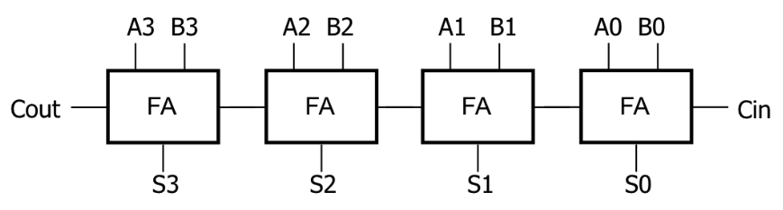
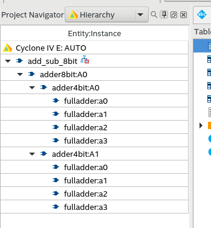
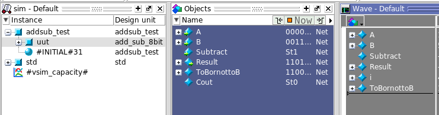

# Lab 2: Projeto Baseado em Hierarquia

<p align="center">
Prof. João Carlos Bittencourt
</p>
<p align="center">
Centro de Ciências Exatas e Tecnológicas
</p>
<p align="center">
Universidade Federal do Recôncavo da Bahia, Cruz das Almas
</p>

## Introdução

Este roteiro de laboratório consiste de várias etapas, cada uma construída a partir da anterior. Instruções detalhadas são fornecidas ao longo do texto, incluindo capturas de tela de várias etapas. Códigos SystemVerilog foram fornecidos para, praticamente, todos os circuitos, mas algumas partes foram apagadas; nesses casos, sua tarefa será completar e testar seu código cuidadosamente. Instruções sobre o acompanhamento são apresentadas ao final.

Você irá aprender a:

- Navegar no ambiente de desenvolvimento do Intel Quartus Prime;
- Projetar um sistema hierárquico, com módulos de vários tipos;
- Trabalhar com barramentos (valores multi-bit);
- Entender sobre testes em SystemVerilog, incluindo exibição no console;
- Simular circuitos em SystemVerilog utilizando o ModelSim Intel FPGA Edition;

Neste laboratório, você irá projetar e testar uma unidade de soma/subtração de 8-bits. Nós iremos nos concentrar na construção do circuito utilizando a abordagem *bottom-up*, dada a sua prática com projetos baseados em hierarquia. 

Vamos iniciar com o projeto de um somador completo, semelhante ao projetado no [Lab 1](https://github.com/GCET231/fpga_labs_21_1/lab1), mas com algumas modificações. Em seguida, iremos interligar quatro somadores completos para formar um somador *ripple-carry* de 4-bits. Na etapa seguinte, vamos combinar dois somadores de 4-bits para produzir um somador de 8-bits. Finalmente, vamos introduzir uma negação condicional na segunda operação, para permitir que a unidade realize uma soma ou subtração, dependendo do sinal Booleano de controle na entrada.

Siga criteriosamente as etapas descritas a seguir.

## Crie um Novo Projeto

Inicie copiando o arquivo `fulladder.sv` do Lab 1 dentro do diretório `src` do Lab 2.

Execute o Quartus Prime, e clique em **New Project Wizard** para criar um novo projeto chamado `lab2` dentro do diretório `fpga`. Na janela **Add Files** localize o arquivo `fulladder.sv`, como apresentado na figura abaixo. 

Em seguida, selecione o nosso dispositivo alvo (`EP4CE115F29C7`).

Para nossa referência, abaixo apresentamos novamente o circuito Booleano agora coma equações para um Somador Completo (extraídos de GCET701). 


Neste roteiro, nós iremos projetar um somador completo **estrutural** usando portas lógicas simples, seguindo exatamente a topologia apresentada no diagrama do circuito acima.

A equação Booleana do circuito é apresentada a seguir:
$$
C_{out} = C_{in}(A\oplus B) + AB\\
	Sum = C_{in}\oplus (A\oplus B)
$$
Edite o módulo do `fulladder` para fazer com que ele seja completamente estrutural, de acordo com o trecho de código a seguir, com alguns detalhes apagados. 

```verilog
	module fulladder (
		input wire A,
		input wire B,
		input wire Cin,
		output wire Sum,
		output wire Cout
	);

		wire t1, t2, t3;
		xor x1(t1, A, B);
		xor x2(Sum, Cin, );
		and a1(t2,      );
		and a2(         );
		or  o1(         );

	endmodule
```

Sua tarefa é completar o código corretamente, garantindo que seu código Verilog coincida exatamente com o circuito do somador completo.

Compile o circuito acima e analise a estrutura do somador completo em **Tools** `>` **Netlist Viewers** `>` **RTL Viewer**. Você deve obter uma representação semelhante à do esquemático do somador apresentado acima.

Vamos agora reutilizar o *testbench* do Lab 1 para verificar essa nova implementação. 

Localize o arquivo `fulladder_test.sv` dentro do diretório `sim` e crie um novo **Compile Tesbench** em **Assignments** `>` **Settings** `>` **Simulation**. 

Agora execute o simulador e observe as formas de onda das saídas. Elas devem ser idênticas àquelas obtidas no Lab 1.

## Projetando um somador ripple-carry de 4-bits

Agora vamos projetar um somador *ripple-carry* de 4 bits ligando quatro instâncias de somador completo (FA). O diagrama de um somador de 4-bits é apresentado aqui como referência.



O código Verilog correspondente é apresentado a seguir, mas algumas partes foram ocultadas. 

```verilog
	module adder4bit (
		input wire [3:0] A,
		input wire [3:0] B,
		input wire Cin,
		output wire [3:0] Sum,
		output wire Cout
	);

		wire C1, C2, C3;
		fulladder a0(A[0], B[0], Cin, Sum[0], C1);
		fulladder a1(A[1], B[1],  , Sum[1],   );
		fulladder a2(A[2], B[2],  , Sum[2],   );
		fulladder a3(A[3], B[3],  , Sum[3],    );

	endmodule
```

Preencha os campos vazios corretamente (você não precisa adicionar mais nenhuma linha de código; apenas preencha os detalhes que faltam). 

Antes de usar este código, você terá que criar um novo arquivo. Clique em **File** `>` **New** `>` **SystemVerilog HDL File** e em seguida clique em **OK**. Salve-o com o nome `adder4bit.sv`, dentro do diretório `src`. 

Certifique-se de fazer com que `adder4bit` seja selecionado como módulo *top level*. Para isso, clique com o botão direito sobre o arquivo e selecione **Set as Top Level Entity**. 

Agora analise o circuito implementado clicando em **Processing** `>` **Start** `>` **Start Analisys and Elaboration** e em seguida clique em **Tools** `>` **Netlist Viewers** `>` **RTL Viewer**. 

Observe que a topologia do circuito é equivalente ao diagrama de blocos de referência. Observe como os 4 bits de entrada `A[3:0]` e `B[3:0]` são desenhados, e os locais onde cada bit é separado (pequenos símbolos na forma de triângulo indicam que um único bit está sendo selecionado de um sinal multi-bit). 

Note ainda como os bits da saída são combinados  em uma saída multi-bit `Sum[3:0]` (com triângulos invertidos indicando como os bits são combinados em um sinal maior).

Localize o arquivo de *testbench* `adder4bit_tb.sv`. Adicione um novo **Compile Testbench** para ele. Leia cuidadosamente cada linha deste *testbench*, e certifique-se de ter entendido tudo! Procure referências *online* e nos links disponíveis no site do curso.

Compile o projeto e execute a simulação clicando em **Tools** `>` **Run Simulation Tool** `>` **RTL Simulation**. Selecione a ferramenta **Zoom Full** para visualizar toda a forma de onda. 

Se você estiver visualizando 0's e 1's, no lugar de valores hexadecimais, selecione o sinal na janela **Wave** (use a tecla `shift` para selecionar todos os sinais), clique com o botão direito, escolha **Radix** e selecione **Hexadecimal**. 

## Projetando um somador ripple-carry de 8-bits

Agora nós iremos projetar um somador de 8-bits usando dois somadores de 4-bits. O procedimento é muito semelhante: crie um novo arquivo e salve-o dentro do diretório `src` e chame-o de `adder8bit`. 

Use código a seguir, e preencha as lacunas necessárias.

```verilog
	module adder8bit (
		input wire [7:0] A,
		input wire [7:0] B,
		input wire Cin,
		output wire [7:0] Sum,
		output wire Cout
	);

		wire C3;
		adder4bit A0(A[3:0], B[3:0], Cin, Sum[3:0], C3);
		adder4bit A1(                                    );		

	endmodule
```

Produza o diagrama esquemático para o código acima e analise-o usando o **RTL Viewer**.

Perceba que cada módulo possui um sinal `+` indicando que o mesmo pode ser expandido afim de exibir seus elementos internos (semelhante a um *zoom in* e *zoom out*). 

Gaste alguns minutos navegando e analisando a hierarquia deste esquemático.

### Simulação Verilog

Modifique o teste usado no somador de 4 bits de modo a fazê-lo funcionar com operandos de 8 bits. Você precisará apenas fazer pequenas alterações. 

Certifique-se de atribuir o novo testbench a um **Compile testbench** e lembre-se de tornar o módulo `adder8bit` o top level. **Faça o teste antes de seguir em frente!**

## Projetando um Somador-Subtrator de 8-bits

Agora você irá projetar um circuito capaz de realizar tanto somas quanto subtrações de 8-bits. Isso é, dadas as duas entradas `A` e `B`, o circuito irá produzir a soma `A+B` ou a diferença `A-B`, de acordo com o valor da entrada Booleana `Subtract`.

O esquema do circuito é apresentado logo abaixo.


Você deve criar um novo arquivo com o nome `add_sub_8bit.sv` e salvá-lo no diretório `src`. Utilize o código abaixo e preencha as partes que faltam.

```verilog
module add_sub_8bit (
		input wire [7:0] A,
		input wire [7:0] B,
		input wire Subtract,
		output wire [7:0] Result
	);

		wire [7:0] ToBornottoB;
		wire Cout;

		assign ToBornottoB[7:0] = {8{Subtract}} ^ B[7:0];
		adder8bit add8(A[7:0], ToBornottoB[7:0],              );		

	endmodule
```

No código acima, o comando de repetição (`{8{Subtract}}`) foi utilizado. Esse trecho de código simplesmente faz com que o valor de `Subtract` se repita, de modo a produzir um valor de 8-bits igual a `00000000` se `Subtract` for igual a `0`, e `11111111` caso contrário. 

O operador `~` é uma operação *bitwise* XOR, logo, cada bit de `B` será operado (XOR) com `Subtract`, assim como no diagrama esquemático acima. 

Note que, enquanto o somador de 8-bits possui um *carry* de saída, o módulo `add_sub_8bit` não envia ele para fora! Além disso, observe com cuidado onde o *carry* de entrada do somador está conectado.

Salve seu arquivo, compile o projeto e, em  seguida, analise a hierarquia na janela **Project Navigator**; ela deve ser exatamente como esta quando você expandir todos os nós.



Agora produza o diagrama esquemático do módulo `add_sub_8bit` utilizando o **RTL Viewer**.

No diagrama, as oito portas XOR representam uma operação *bitwise* nos 8-bits de entrada. 

Observe ainda que ligações de um único bit são representadas por uma linha fina, e fios múlti-bit (chamados de "barramentos") usando linhas mais grossas. 

Quando a quantidade de fios de entrada (ex. `O[7:0]` entrando no somador) coincide com o número de terminais de entrada (`B[7:0]` neste caso), a conexão é dita um-para-um: `O[7]` com `B[7]`, `O[6]` com `B[6]`, e assim por diante. 

Por outro lado, se houver apenas um fio conectado a um terminal de entrada múltiplo -- ex.: um `Subtract` de 1-bit à uma entrada `I0[7:0]` -- então, o valor de `Subtract` é aplicado a cada um dos terminais de entrada.

### Simulação Verilog

Crie um novo **Compile test bench**, chamado `addsub_tb`, vincule-o ao arquivo `addsub_tb.sv`, marque como *testbench* ativo, e então execute a simulação. 

Uma vez que o tamanho padrão da janela de forma de onda é muito pequena, clique no botão **Dock/Undock**, localizado no canto superior direito da janela **Wave**. Redimensione a janela e clique no botão **Zoom Full**. 

Dessa vez selecione todos os sinais, clique com o botão direito, escolha **Radix**, e selecione **Decimal**. Você agora deve visualizar todas as saídas no formato decimal.

Agora, vamos exibir o barramento `ToBornottoB` que está dentro do módulo `add_sub_8bit`. 

No painel **Instance**, ao selecionar  `uut` você verá os objetos e fios dentro dele no painel **Objects**. Clique e arraste o sinal `ToBornottoB` para a janela de forma de onda.



Na janela do ModelSim, clique em **Simulate** `>` **Restart** e em seguida clique em **Simulate** `>` **Run** `>` **Run -All**. 

Uma vez que a simulação finalize, o valor de `ToBornottoB` será exibido na janela de formas de ondas -- Se necessário, retorne o **Radix** de `B` para **Binary**. 

Observe que eles são idênticos na primeira metade da simulação (uma vez que são somas sendo realizadas), e complementos *bitwise* durante a segunda metade (uma vez que agora estão sendo realizadas subtrações).

Este exercício mostrou como analisar objetos que não estão na entidade *top level*, mas sim em um nível inferior da hierarquia. 

Observe que você pode clicar em um instante específico de tempo na janela de formas de onda. A coluna **Msgs** é atualizada para exibir os valores de todos os sinais naquele instante de tempo. 

Existem ainda vários botões para ampliar e reduzir a visualização, saltar para a próxima transição, dentre outras.

> ***Responda***
>
> ​	Por que que o valor de `i` aparece como `x` (uma linha vermelha) nos primeiros 5 ns?

### Utilizando os comandos `$display` e `$monitor`

Na parte inferior do arquivo de *testbench*, localize os comandos utilizando `$time`, `$timeformat`, e `$monitor`. 

O comando `$monitor` diz para o simulador imprimir uma mensagem sempre que houver uma mudança de valores em um de seus argumentos (com exceção do `$time`). A saída aparece na janela **Console** do ModelSim (painel na parte inferior da tela): role algumas linhas para cima para ver a saída desses comandos.

Leia as referências online disponíveis para obter mais detalhes sobre esses comandos, e certifique-se de você entendeu eles! Você deve procurar aprender também sobre como usar os comandos `$display` e `$write`.

## Entregáveis do Laboratório

### Acompanhamento (entrega: 15h, Sexta-feira 10 de Setembro, 2021)

Em um documento associado à sua entrega no Google Sala de Aula, submeta o que se pede:

1. Uma captura de tela da janela de forma de onda, mostrando claramente **o resultado final da simulação** do somador-subtrator (incluindo o sinal `ToBornottoB`).
   1. Os valores de `ToBornottoB` e `B` devem estar representados no sistema **binário**.
   2. Os valores de `Result`, `A`, `Subtract` e `i` devem ser exibidos no formato decimal.
   3. Utilize a ferramenta de *zoom* de forma que a imagem permita visualizar, com clareza, esses valores. Se você não puder captura todos os detalhes relevantes em razão da resolução da tela, poderá enviar mais de uma imagem.

Apresente uma descrição dos procedimentos realizados neste laboratório, de acordo com o modelo.