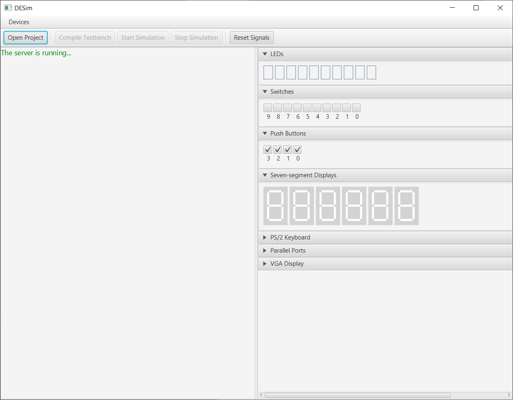
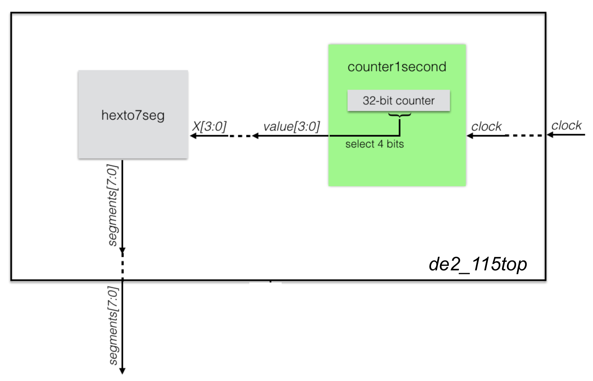

# Lab 5: Projeto Sequencial - Contadores e Decodificadores

Prof. João Carlos Bittencourt

Centro de Ciências Exatas e Tecnológicas

Universidade Federal do Recôncavo da Bahia, Cruz das Almas

## Introdução

Este laboratório introduz você ao simulador da plataforma de desenvolvimento de hardware que será usado até o final do semestre. Este novo roteiro, é um complemento ao laboratório anterior e consiste de três etapas, cada qual construída com base na anterior. Ao longo desta prática você irá:

- Projetar codificadores/decodificadores (para alimentar um *display* de 7-segmentos);
- Projetar uma referência de tempo usando contadores;
- Executar um circuito sequencial no simulador [DESim](https://github.com/fpgacademy/DESim).

## Leia o Manual

Durante o período de Ensino Remoto Emergencial, GCET231 utiliza a plataforma de simulação DESim. O DESim disponibiliza uma interface gráfica de usuário contendo alguns dos recursos da plataforma de desenvolvimento DE1-SoC. Essa GUI serve como um *front end* para o simulador ModelSim. 

As informações sobre o simulador podem ser obtidas no [repositório do DESim](https://github.com/fpgacademy/DESim/releases/tag/v1.0.1). Faça o download do guia de instalação e siga o passo-a-passo para instalar o simulador (somente para Windows).

## O Simulador

A Figura a seguir apresenta uma visão da interface gráfica do simulador, indicando os componentes presentes no mesmo. 

A seguir apresentamos uma lista elencando os seus componentes principais sob o ponto de vista de GCET231.  

- 10 LEDs
- 10 chaves
- 4 push-buttons
- 6 displays de 7 segmentos
- Interface VGA

## Parte 1 - Um codificador para display de 7-segmentos

Vamos começar projetando um codificador capaz de converter um único dígito decimal (valor de 4-bits) em um padrão binário capaz de exibir sua representação em um display de 7-segmentos. Os arquivos do laboratório já incluem um projeto do circuito no simulador DESim.

O principal arquivo do projeto é o `dec7seg.sv`, também fornecido junto com os arquivos de laboratório, ao seu novo projeto. A plataforma DESim possui um conjunto de *displays* de 7-segmentos de 6 dígitos. Neste laboratório, nós usaremos apenas um dígito (o mais à direita); os outros cinco permanecerão inativos. 

A Figura apresentada acima substitui as interfaces presentes na placa DE1-SoC. Localize as Seções 3.6.1 e 3.6.2 do [User Manual da placa DE1-SoC](https://www.intel.com/content/dam/altera-www/global/en_US/portal/dsn/42/doc-us-dsnbk-42-1004282204-de1-soc-user-manual.pdf) e leia cuidadosamente de modo a entender o funcionamento das chaves e do *display* de 7-segmentos. 

O módulo especificado no arquivo `DESim_top.sv` já está configurado de modo a mapear as portas de entrada/saída para pinos da placa.

-  Nós usaremos as quatro chaves mais à direita para a entrada de 4-bits, `SW[3:0]`. Na DE1-SoC, esses pinos são nomeados como \{AB12, AC12, AF9, AF10} (confira na figura presente no manual, localizando também os rótulos próximos às chaves, na placa). Nesta configuração AB12 é o MSB e AF10 é o LSB.
-  Nós usaremos também uma saída de 7-bits no nosso módulo SystemVerilog para conectar a saída referente ao *display* de 7-segmentos `HEX0[6:0]`. Na DE1-SoC, esses pinos são nomeados como {AE26, AE27, AE28, AG27, AF28, AG28, AH28}.

Certifique-se de ler o código SystemVerilog fornecido (`dec7seg.sv`) e o manual de referência indicado acima, e garanta que você também entendeu por que existe uma negação na frente da atribuição do padrão em `segments[6:0]`.

Agora modifique a implementação do arquivo `DESim_top.sv` de modo que ele apresente uma instância de `dec7seg` devidamente ligada aos pinos de entrada e saída da placa. Quando estiver pronto para testar a sua implementação, execute a simulação no DESim. 

Para executar a simulação inicie o DESim. Você deve visualizar a mensagem "The server is running..." na parte superior do painel de mensagens. Se vir uma mensagem de "Server setup failed" então o software não está funcionando corretamente e deve ser reiniciado. Clique no botão **Open Project** e selecione a pasta do `lab5`. 

Clique no botão **Compile Testbench** e aguarde até que o projeto seja compilado. Se tudo ocorrer como esperado o simulador apresentará a mensagem "Compilation successful". Inicie a simulação clicando no botão **Start Simulation**. Caso algo dê errado, verifique as mensagens no console, retorne ao código e verifique o que deu errado. 

Se tudo correr como esperado, seu circuito está agora implementado no simulador e em execução. Agora é sua vez de brincar com as chaves para verificar se as saídas correspondem ao esperado. 

## Parte 2 - Um Codificador Hexadecimal para Display de 7 Segmentos

Copie o conteúdo do arquivo `dec7seg.sv` e cole em um novo arquivo chamado `hexto7seg.sv` dentro do diretório `src`. Modifique o nome do módulo para `hexto7seg`. Altere o arquivo `DESim_top.sv` para instanciar o módulo `hexto7seg` (i.e. comente a instância de `dec7seg` e inclua a nova instanciação para `hexto7seg`).

Modifique o codificador para lidar com um dígito hexadecimal (ou seja, "0" até "F"). Basicamente, você precisa acrescentar seis linhas adicionais ao módulo, para lidar com os casos "A" até "F". Não importa se você escolher exibir as letras maiúsculas ou minúsculas (e.g. "a" *vs.* "A").

Execute o projeto no simulador  e confirme se o circuito é capaz de exibir de "0" até "F".

## Parte 3 - Exibindo um contador de único dígito Hexadecimal

Modifique o projeto da Parte 2 de modo que o valor a ser exibido não parta das chaves de entrada. Você deverá criar um contador que percorre os valores "0" -- "F" repetidas vezes, e transmite esse valor dentro do seu codificador hexadecimal da Parte 2. Para observar se o seu projeto está funcionando corretamente, o contador deve operar a uma velocidade razoável. Faça-o contar a uma taxa de aproximadamente uma transição por segundo (aproximadamente 1 Hz).

Seu contador precisará de um sinal de *clock*. Para isso, a placa DE1-SoC fornece um sinal de 50 MHz no pino AF14} (veja a Seção 3.5 do manual da DE1-SoC). Uma vez que a placa fornece um clock de 50 MHz associamos ele à porta `CLOCK_50`, declarada no arquivo DESim_top.sv}, a qual está ligada ao sinal correspondente no simulador.

Agora, construa um contador de 32-bits, mesmo que ele use somente quatro bits. Os bits menos significativos, obviamente, transitarão com uma frequência maior (o LSB muda 50 milhões de vezes em 1 segundo!). Por outro lado, os bits mais significativo alternam com uma velocidade menor. Você deve encontrar 4 bits consecutivos em algum lugar dentro desta faixa de modo que o bit menos significativo alterne, aproximadamente, uma vez por segundo (1 Hz). Esses 4 bits formarão um número hexadecimal (`0x0` até `0xF`), que deve ser exibido no *display* de 7-segmentos.

>  **Dica:** você não chegará a obter exatamente o valor equivalente a uma transição por segundo, mas qualquer taxa entre meio segundo e dois segundos poderá ser considerado para avaliação.

Certifique-se de produzir um circuito modularizado, ou seja, o módulo `DESim_top` deve possuir dois módulos (um contador e um codificador hexadecimal para 7-segmentos). Dessa forma, devem haver dois arquivos SystemVerilog distintos, além do `DESim_top.sv`:

-  `hexto7seg.sv` usado na Parte 2. 
-  `counter1second.sv` usado para contar um valor de 4 bits que muda a uma taxa aproximada de 1 valor por segundo.

Lembre-se de usar os nomes de arquivo solicitados acima e seguir um modelo de hierarquia apropriado. O diagrama de blocos a seguir apresenta a hierarquia que o seu projeto deve seguir. **Você será penalizado se o projeto não seguir a construção modular especificada nessa figura.**

## Acompanhamento

### Acompanhamento (entrega: sexta-feira 17 de dezembro, 2021)

Em um documento associado à sua entrega no Google Sala de Aula, submeta o que se pede:

- O código dos arquivos `hexto7seg.sv`, `counter1second.sv` e `DESim_top.sv`
- Apresente uma demonstração da Parte 3 na forma de um vídeo demonstrando o funcionamento do circuito no simulador DESim.

Inclua no documento uma descrição dos procedimentos realizados neste laboratório, de acordo com o modelo.

## Agradecimentos

Esse roteiro é fruto do trabalho coletivo dos professores e monitores de GCET231:

- **2021.1:** Everton Santos, Matheus Pithon
