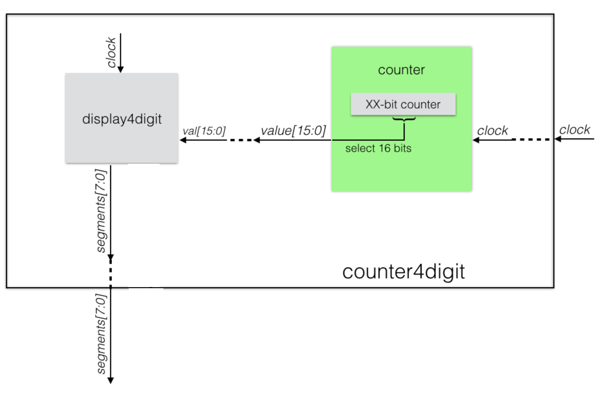

# Lab 6: Dispositivos de Entrada e Saída

Prof. João Carlos Bittencourt

Centro de Ciências Exatas e Tecnológicas

Universidade Federal do Recôncavo da Bahia, Cruz das Almas

## Introdução

Este laboratório é mais uma das atividades de desenvolvimento envolvendo o simulador DESim. O roteiro consiste de três etapas, cada qual construída com base na anterior. Os arquivos referentes a cada etapa estão organizados, de acordo com a numeração apresentada à seguir.

Ao longo desta prática você irá aprender a:

- Alimentar um conjunto de displays de 7 segmentos.
- Trabalhar com decimais codificados em binário (ou BCD).
- Trabalhar com um dispositivo de interface PS/2.
- Integrar os dispositivos de E/S em uma demonstração.

## Parte 0 - Projetando um display de 7 segmentos de 4 dígitos

Copie o seu arquivo `hexto7seg.sv` do Lab 5 para o diretório `src` e, em seguida, faça o que segue:

- Desenvolva o módulo `counter4digit` e defina-o como módulo _top-level_ do projeto.
- Analise o arquivo `displayNdigit.sv` disponibilizado junto com os arquivos de laboratório.
  - Este arquivo possui um módulo chamado `displayNdigit`. Este componente é um capaz de alimentar, de forma paralela, um conjunto de displays de 7 segmentos, usando um conjunto de _N_ codificadores de dígitos hexadecimais (instância de `hexto7seg`).
  - Observe o parâmetro `NDIG`. Ele é responsável por indicar a quantidade de displays de 7 segmentos utilizados.
  - Observe ainda o sinal de saída `segments` declarado como um _packed vector_. Este procedimento ajuda na redução da quantidade de sinais na saída do módulo.
- Implemente o módulo `displayNdigit` de modo que:
  - Para uma entrada de tamanho `NDIG x 4`, exiba o seu valor em hexadecimal em um conjunto de 4 displays de segmentos. Para isso, você poderá usar `NDIG = 4`.
  - Utilize o comando `generate` para implementar sua solução.
- Alimente o módulo `displayNdigit` com 16 bits oriundos de um contador. Este módulo é rotulado como `counter` na Figura abaixo (em verde) e você terá que criá-lo dentro de um arquivo chamado `counter.sv`. Você poderá modificar a largura desse contador para que ele seja maior do que 32 bits, para ser capaz de selecionar 16 bits que não estejam alternando tão rapidamente. Escolha esses 16 bits de modo que o dígito hexadecimal alterne aproximadamente 16 vezes por segundo; o primeiro dígito irá então alternar uma vez por segundo; o digito seguinte irá comutar uma vez a cada 16 segundos; e o dígito mais a esquerda será modificado uma vez a cada 256 segundos. Todos esses tempos são precisamente uma potência de dois. **Em razão do indeterminismo dos temporizadores associados ao DESim, esses valores podem não ser precisos. Para encontrar os valores mais adequados você poderá utilizar o modo "tentativa e erro"**.

## Parte 1: Estendendo para um display de 7 segmentos de 6 dígitos

Estenda o módulo para display de 4 dígitos da **Parte 0** para um módulo de display de 6 dígitos chamados `displayNdigit`, em um arquivo chamado `displayNdigit.sv`, realizando as etapas a seguir:

- Crie um novo módulo _top-level_ chamado `counter6digit`, semelhante ao `counter4digit` que você criou na Parte 0. Salve-o no arquivo `counter6digit.sv` Verifique os novos sinais de saída que precisam ser criados e certifique-se de descrever as suas atribuição.
- Alimente 24 bits (no lugar de 16 bits) neste display, a partir do módulo contador. Escolha esses 24 bits de forma que _o dígito menos significativo alterne 256 vezes por segundo_; o próximo dígito irá alternar 16 vezes por segundo; o dígito a seguir irá alternar uma vez por segundo; o próximo a cada 16 segundos e assim por diante. Todos esses tempos devem ser precisamente potências de dois.

Execute o código no simulador, alterando instanciando um novo módulo _top level_ no local indicado dentro do arquivo `top.v`.

**Observe que será necessário comentar o código da instância para `counter4digit` antes de executar o simulador. Caso contrário a simulação não funcionará corretamente**

## Parte 2: Entendendo o módulo de teclado

A principal descrição do módulo do teclado está em `keyboard.sv`. Leia o arquivo e tente entende-lo. Verifique o manual do simulador, e da placa DE1-SoC, na seção _PS/2 Serial Port_. Tudo bem se nem tudo fizer sentido neste momento.

Uma demonstração de funcionamento do teclado foi fornecida a você no arquivo `keyboard_tester.sv`. Use o seu código para o display de 7 segmentos de 6 dígitos da Parte 1, no arquivo `displayNdigit.sv`. Agora, defina o módulo `keyboard_tester` como _top-level_, removendo os comentários indicados no arquivo `/sim/top.v`.

**Antes de executar a nova simulação, garanta que exista apenas uma instância dentro do módulo `top`**

Dentro do diretório `sim` está um emulador de teclado PS/2 que funciona juntamente com a interface do DESim para fornecer uma entrada como se fosse um teclado PS/2 de verdade conectado ao circuito. Utilize a interface de entrada PS/2 "pressionar uma tecla do teclado". Ao pressionar as teclas do teclado, um código especial para cada evento (denominado _scancode_) é recebido, e então exibido nos displays de 7 segmentos.

## Parte 3: Integrando os dispositivos de E/S em uma nova demonstração

Sua tarefa agora é criar uma nova demonstração integrando os dispositivos de E/S apresentados aqui de uma nova maneira. Crie um novo módulo _top-level_ chamado `io_demo`, e chame seu novo arquivo de `io_demo.sv`.

Integre o teclado aos primeiros 8 LEDs do simulador. Codifique um conjunto de 8 caracteres ASCII, de modo que cada tecla pressionada resulte no acendimento de um único LED. Essencialmente, você deve mapear o _scancode_ de um conjunto arbitrário de teclas para uma sequência binária de codificação _one-hot_, a qual deve ser exibida nos LEDs da placa.

## Acompanhamento (entrega: sexta-feira 4 de fevereiro, 2022)

Em um documento associado à sua entrega no Google Sala de Aula, submeta o que se pede:

- Os códigos top-level: `io_demo.sv` e `displayNdigit.sv`.
- Apresente um vídeo demonstrando o funcionamento do circuito da Parte 3 no simulador DESim.

Inclua no documento uma breve descrição dos procedimentos realizados neste laboratório, de acordo com o modelo.

## Agradecimentos

Esse roteiro é fruto do trabalho coletivo dos professores e monitores de GCET231:

- **2021.1:** Everton Santos, Matheus Pithon
