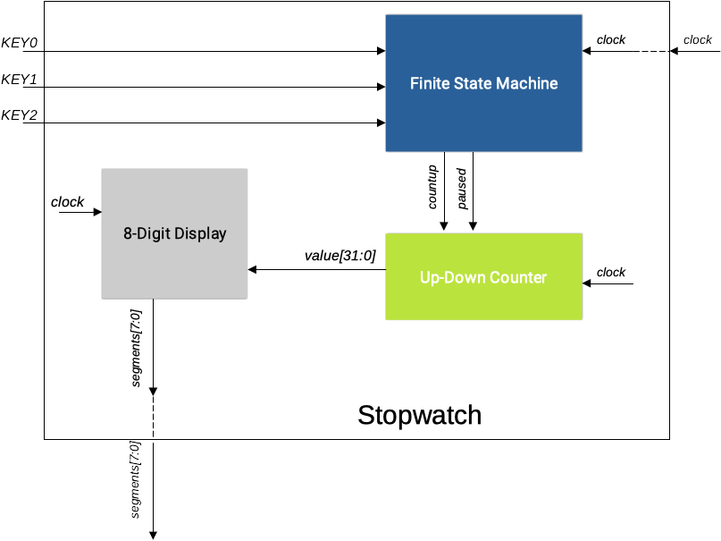
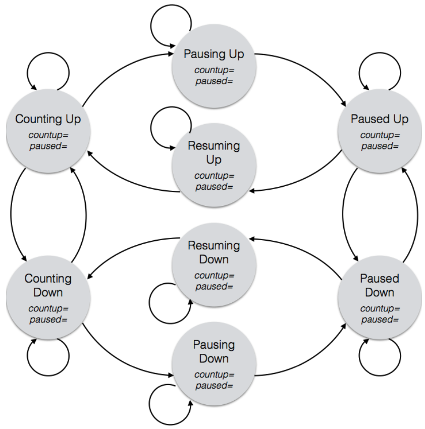

# Lab 7: Stop Watch

Prof. João Carlos Bittencourt

Centro de Ciências Exatas e Tecnológicas

Universidade Federal do Recôncavo da Bahia, Cruz das Almas

## Introdução

Ao longo desta prática você irá aprender a:

- Filtrar chaves de entrada utilizando um circuito _debouncing_.
- Desenvolver um _stop watch_ progressivo-regressivo.
- Escrever lógica combinacional usando atribuição não contínua

## Projete um stop watch de 6 dígitos hexadecimais completo

Sua única tarefa é adicionar as funcionalidades a seguir para o seu contador de 6 dígitos (`counterNdigit` da Parte 1 do Lab 6):

1. habilidade de contagem crescente ou decrescente;
2. habilidade de parar e iniciar (pausar e recomeçar).

Seu projeto deve ainda atender aos requisitos a seguir:

- Use os _push-buttons_ no lugar das chaves: _KEY1_ para contagem crescente, _KEY2_ para contagem decrescente, _KEY3_ para interromper e retomar.
- O contador começa em 0 com uma contagem ascendente. Se o contador estiver incrementando e chegar em `FFFFFF`, ele simplesmente retoma para `000000` e continua a contar novamente. De forma similar, se o contador estiver em contagem decrescente e chegar em `000000`, o mesmo retornará para `FFFFFF` e continua a contagem. _Dica:_ nenhuma dessas funcionalidades requer um circuito especial; a especificação acima representa exatamente como um circuito contator se comporta ao atingir o limite de contagem.
- O dígito menos significativo deve contar à uma taxa de _aproximadamente_} **256 vezes por segundo**.

O comportamento esperado para o circuito é descrito a seguir em mais detalhes:

- O contador inicia em 0, e começa a contagem crescente.
- Se, a qualquer momento, o botão _KEY2_ for pressionado, o contador alterna seu modo contagem para decrescente. Da mesma forma, se a qualquer momento o botão _KEY1_ for pressionado, o contador alterna seu modo de contagem para crescente (pressionar o botão crescente enquanto o contador já estiver no modo crescente não produzirá efeito algum; assim como deve acontecer no modo decrescente).
- Se o contador estiver em contagem (crescente ou decrescente), e o botão _KEY3_ for pressionado, o contador interrompe a contagem e mantêm o valor atual. Em seguida, o mesmo botão deve ser pressionado novamente para que a contagem seja retomada.
- Quando a contagem estiver parada, a direção da contagem (crescente ou decrescente) é mantida, de modo que, na retomada, o contador continue na mesma direção. Entretanto, durante a pausa, a direção do contador pode ser modificada, se os botões _KEY1_ e _KEY2_ forem pressionados.
- Em resumo, o botão _KEY3_ alterna entre contagem e parada, enquanto os botões _KEY1_ e _KEY2_ alteram a direção da contagem.

Para acompanhar todos os estados do sistema você precisará de uma máquina de estados finitos (FSM). A figura a seguir apresenta um diagrama que descreve a hierarquia deste circuito. _Garanta que sua especificação Verilog coincida exatamente com diagrama apresentado._

Certifique-se que o seu projeto contenha os módulos a seguir em seus arquivos Verilog:

- Display de 8 dígitos: `displayNdigit.sv`
- Máquina de Estados Finitos: `fsm.sv`
- Contador Up-Down BCD: `updowncounter.sv`
- Módulo top level do _stop watch_ (tudo deve estar dentro dele): `stopwatch.sv`

Para ajudar a implementar sua FSM, um diagrama de transição de estados é apresentado a seguir. Você precisará preencher os detalhes que faltam.

Você deve rotular as entradas sob os arcos e as saídas dentro dos estados (máquina de estados de Moore). Siga o fluxo de projeto usual para converter o seu diagrama de estados em uma especificação Verilog (utilize o modelo fornecido no arquivo `lab7\_fsm\_template.sv`).

## Acompanhamento (entrega: sexta-feira 18 de fevereiro, 2022)

Em um documento associado à sua entrega no Google Sala de Aula, submeta o que se pede:

- Os arquivos Verilog: `fsm.sv` `updowncounter.sv`, `stopwatch.sv`.
- Uma imagem (foto de celular) ou versão escaneada do diagrama de estados acima devidamente preenchido.
- Apresente um vídeo demonstrando o funcionamento do circuito no simulador DESim.

Inclua no documento uma breve descrição dos procedimentos realizados neste laboratório, de acordo com o modelo.

## Agradecimentos

Esse roteiro é fruto do trabalho coletivo dos professores e monitores de GCET231:

- **2021.1:** Everton Santos, Matheus Pithon
