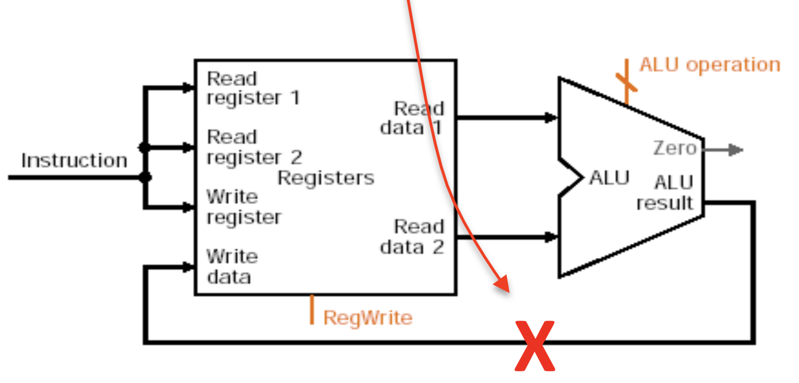
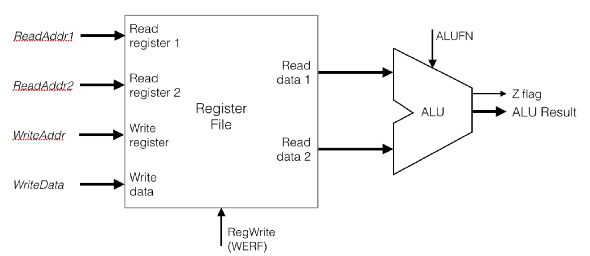

# Lab 8: Um Caminho de Dados Simples

<p align="center">
Prof. João Carlos Bittencourt
</p>
<p align="center">
Centro de Ciências Exatas e Tecnológicas
</p>
<p align="center">
Universidade Federal do Recôncavo da Bahia, Cruz das Almas
</p>

## Introdução

Este roteiro de laboratório consiste de um conjunto de etapas, cada qual construída com base na anterior. Instruções detalhadas para a realização dos procedimento são fornecidas ao longo do texto. Os códigos SystemVerilog para quase dodos os componentes foi fornecido junto com os arquivos de laboratório, mas algumas partes foram apagadas propositalmente; nestes casos, é sua tarefa completar e testar seu código com cuidado.

Ao longo desta prática você irá aprender a:

- Especificar memórias em SystemVerilog.
- Inicializar memórias.
- Projetar uma memória de múltiplas portas (_register-file_ de 3-portas).
- Integrar ALU, registradores, etc., para formar um caminho de dados simples.

## Parte 0 - Entendendo como memórias são especificadas em SystemVerilog

Um módulo de memória _single-port_ RAM é descrito, em SystemVerilog, como apresentado no arquivo `ram.sv`. O número de "portas" em uma memória corresponde à quantidade de operações de leitura/escrita que podem ser realizadas de forma concorrente. Sendo assim, a quantidade de portas, tipicamente, é igual ao número de endereços distintos que podem ser fornecidos para a memória. Uma RAM _single-port_ recebe um único endereço como entrada, e pode realizar apenas uma operação de leitura ou escrita (determinada por um sinal de habilitação de escrita) para aquele endereço. O código a seguir descreve a parte principal da especificação de uma memória.

```verilog
logic [Dbits-1:0] mem [Nloc-1:0]; // define onde o dado está localizado

always @(posedge clock) // escrita acontece a cada pulso de clock
   if(wr) mem[addr] <= din; // ... mas somente se a escrita estiver ativa

assign dout = mem[addr]; // a leitura da memória é assíncrona
```

Analise o arquivo `ram.sv` para ter uma descrição completa de um módulo de memória RAM.

### Inicialização da Memória

Uma memória não inicializada possui "lixo" (i.e., valores não definidos), apesar de geralmente um FPGA inicializar todas as linhas de memória com zeros (ou uns). Você pode, especificar os valores a serem armazenados na memória durante a sua inicialização. Isso pode ser feito usando os comandos `$readmemh` ou `$readmemb`. O primeiro comando permite que você especifique valores em um arquivo no formato hexadecimal, enquanto o último utiliza o formato binário.

Adicione a linha a seguir ao seu módulo de memória logo após a linha onde o núcleo de armazenamento é especificado (i.e., logo após `logic [Dbits-1:0] mem [Nloc-1:0]`):

```verilog
initial $readmemh(``mem_data.mem'', mem, 0, Nloc-1);
```

Lembre de colocar a linha de inicialização _após_ a declaração do tipo lógico `mem`, e lembre-se ainda de substituir `mem` pelo nome do seu elemento de memória.

O primeiro argumento do `$readmemh` é uma _string_ que corresponde ao nome do arquivo a ser lido, linha por linha, durante a compilação e síntese. Seu conteúdo é utilizado para inicializar os valores de memória. Os últimos dois argumentos especificam a faixa de posições de memória. Neste caso, `Nloc-1`, mas você pode especificar um subconjunto de valores, se você não possui dados para inicializar toda a memória.

Crie o arquivo `mem_data.mem` na pasta `verilog` do projeto (usando um editor externo).%, e adicione ele ao seu projeto indicando o me
Adicione os valores, um por linha, em hexadecimal. Não introduza o prefixo `h`. Deste modo, se sua memória possui dados de 8-bits, seu arquivo de inicialização deve se parecer com isso:

```
05
A0
C1
...
```

Você pode ainda usar a versão binária da inicialização (`$readmemb` no lugar de `$readmemh`). Neste caso, o arquivo possuirá uma sequência de valores binários, um por linha (não use o prefixo `b`):

```
0000_0101 // underline pode ser utilizado para facilitar a leitura
1010_0000
1100_0001
...
```

Lembre-se que se o seu caminho de dados utiliza 32 bits, e que, portanto, os valores de inicialização em `mem_data.mem` terão que apresentar valores de 32 bits.

## Pate 1 - Register File

Nesse laboratório você irá começar a desenvolver o processador MIPS que nós utilizaremos no projeto final. Você vai projetar e testar uma parte do caminho de dados do processador apresentado no diagrama a seguir. Entretanto, uma vez que nós não temos uma fonte de instruções, e para auxiliar nossos testes, você irá fazer uma leve mudança nesta parte do caminho de dados para proporcionar maior controlabilidade e visibilidade. De forma mais específica, vamos remover o caminho de retorno da ULA para a porta de escrita do _register file_, e no lugar, permitir que o sinal `WriteData` seja fornecido diretamente para o _testbench_. Uma figura modificada será apresentada na próxima parte do laboratório.



**NOTE:** _nós não implementaremos o caminho de dados da Figura acima nesta parte. Veja a Figura da próxima seção._

Primeiramente, você irá projetar um _register file_ de 3-portas. Isso que dizer que ele permite que três endereços diferentes sejam especificados a qualquer momento na entrada: _Read Address 1_, _Read Address 2_ e _Write Addr_. Eles são necessários para acessar (até) dois operandos fonte e um operando de destino, necessários para instruções MIPS.

A partir da descrição acima, faça o que é solicitado:

- Abra o esqueleto para um _register file_ fornecido junto com os arquivos de laboratório (`register_file.sv`), e compare-o com uma implementação típica de módulo RAM (arquivo `ram.sv`). O _register file_ difere da memória RAM no que se refere aos elementos a seguir:
  - três endereços de entrada, no lugar de apenas um (e.g., _Read Address 1_, _Read Address 2_,} e _Write Addr_}).
  - duas saídas de dados, no lugar de apenas uma (e.g., _ReadData1_ e _ReadData2_).
  - o sinal de habilitação da escrita e o clock permanecem os mesmos.
  - durante a escrita, _WriteAddr_ é usado para determinar a posição de memória a ser escrita.
  - na _leitura_ do registrador 0, o valor lido deve ser sempre igual a 0 (não importa que valor é escrito nele, ou mesmo que você escreva algum valor).
- Certifique-se de utilizar parâmetros para a quantidade de posições de memória (`Nloc`), número de bits de dados (`Dbits`), e o nome do arquivo que armazenarão os valores de inicialização (`initfile`).
- Na versão final do projeto do seu processador, os três endereços serão oriundos dos campos do registrador na instrução sendo executada, por enquanto, você utilizará um _testbench_ em SystemVerilog (na Parte 2) para fornecer os três endereços, o dado a ser escrito, e o sinal _RegWrite_. O _testbench_ faz algumas leituras e escritas de modo que você poderá visualizar, através da simulação, se o seu _register file_ está funcionando corretamente.

## Parte 2 - Juntando o Caminho de Dados

Projete um módulo _top-level_ que contenha o _register file_ e sua ALU (do Lab 3). Chame seu arquivo SystemVerilog de `datapath.sv`. Este módulo deverá corresponder exatamente ao diagrama de blocos abaixo.



Agora note o seguinte:

- Para auxiliar nos testes do seu projeto, envie `ReadData1`, `ReadData2` e `ALUResult` para a saída do módulo _top-level_, de modo que eles possam ser visualizados durante a simulação. A _flag_ Zero (`Z`) também deve ser fornecida como uma saída do módulo _top-level_ (uma vez que as instruções de _branch_ necessitarão dela).
- Por enquanto, você não alimentará o resultado da ALU de volta para o _register file_. No lugar disso, o dado a ser escrito no _register file_ deve vir direto do _testbench_ como uma entrada para o módulo _top-level_.}
- As entradas para o módulo _top-level_ são: `clock`, `RegWrite`, os três endereços, a operação da ALU a ser realizada (`ALUFN`), e o dado a ser escrito dentro do registrador (`WriteData`).
- Use o _testbench_ fornecido junto com os arquivos de laboratório para simular e testar o seu projeto. O _testbench_ é auto-verificável, de forma que os erros serão indicados automaticamente. **Certifique-se de usar exatamente os mesmos nomes para as entradas e saídas do _top-level_** daqueles utilizados no _testbench_, onde a _unit under test_ é instanciada.

## Acompanhamento (entrega: sexta-feira 25 de fevereiro, 2022)

Em um documento associado à sua entrega no Google Sala de Aula, submeta o que se pede:

- Os arquivos Verilog: `register_file.sv` e `datapath.sv`.
- Uma captura de tela da janela de simulação para a **Parte 2**, utilizando o _testbench_ fornecido.

Inclua no documento uma breve descrição dos procedimentos realizados neste laboratório, de acordo com o modelo.

## Agradecimentos

Esse roteiro é fruto do trabalho coletivo dos professores e monitores de GCET231:

- **2021.1:** Everton Santos, Matheus Pithon
